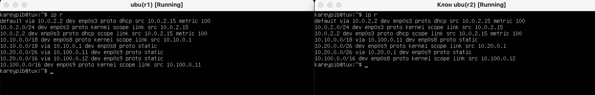

****## Part 1. Инструмент ipcalc

На всякий случай

```sh
    sudo apt-get istall ipcalc
```
ipcalc - це калькулятор, который рассчитает подсеть, диапозон, расскажет про ip, сеть, класс и тд.

### 1.1.Сети и маски


```sh
 адрес сети 1
```

```sh
адрес сети 2
```

*Префиксная /24 . Двоичная 11111111.11111111.11111111.00000000*

*Префиксная /15 . 255.255.254.0. Двоичная 11111111.11111110.00000000.00000000*

*Префиксная /28 255.255.255.240. Двоичная 11111111.11111111.11111111.11110000*


```sh
host_Min && host_Max
```
### 1.2. localhost

*можно обратиться к **localhost**: 127.0.0.2, 127.1.0.1*

*нельзя обратиться к **localhost**: 194.34.23.100, 128.0.0.1*

## 1.3 Диапозоны и сегменты сетей

**Public**: 134.43.0.2, 172.0.2.1, 192.172.0.1, 172.68.0.2, 192.169.168.1

**Private**: 10.0.0.45, 192.168.4.2, 172.20.250.4, 172.16.255.255 , 10.10.10.10

**gateway**: 10.10.0.2, 10.10.10.10, 10.10.1.255

**N0_gateway**: 10.0.0.1, 10.10.100.1

# Part 2. Статическая маршрутизация между двумя машинами

Итак, начнем со среды. Чтобы все ок было, нам нужно не просто вывести сетевые интерфейсы, а сделать так, чтобы отобразился еще один или несколько.

Чтобы это сделать, перейде в самой среде Файл => Менеджер сетей и хоста => и создадим адаптер внутренней сети. ОК? Если да, то в настройках уже виртуальной машины тыкай на сеть => тык на адаптер 2 => тык тип подключения => выбирай адаптер, который создали в менеджере сетей. Главное помни, что все эти настройки нужно делать, когда машины **выключены!!!**

Если все ок настроил в среде ORACLE, то тогда при вводе команды
```sh
    ip a
```
мы увидим доп сетевой тырфейс


А теперь давай опишем сетевые тырфейсы и познакомим их друг с другом.

```sh
sudo vim /etc/netplan/00-installer-config.yaml
```
это если ты не знал || забыл, где этот план находится


все что нуно сделать, это описать появившийся тырфейс из среды. Думаю понятно, что он должен быть статическим исходя из
названия.

Суть конструкции
```sh
-to:
via:
```
to - это с кем знакомимся или куда отправляемся

via - это мы

А теперь проверим, что вышло и пинганем их. Не забываем принять нетпланы

```sh
sudo netplan apply
```
но сначала сделаем дебаг, вдруг я допустил ошибку


допустил...

окей дхсп без циферки 4 он не знает, исправили и принимаем


Все прошло успешно, теперь посмотрим познакомились ли машины и пингуются ли они


хоть я и показал уже готовый нетплан, но для многоуважающих пиров, которые любят подушить я вставлю еще один скрин, где делаю статические маршруты от одной машины, к другой...


отлично, с формальностямт закончили

## Part 3. Утилита iperf3

iperf3 - спидтест только в терминале. Работает эта штука , как клиет=сервер. Это значит, чтобы измерить скорость, нужно сначало сделать серв прием. Значит на машине до которой будем пробивать пиши
```sh
iperf3 -s
```
а на другой машине, у которой будеем мерять скорость
```sh
iperf3 -c <ip_addr>
```


ты обязательно спросишь, а чо это там у тебя еще за флаги **-f M**? Ну так все просто, пресс F это формат, а М это величина вывода.

Ответики на вопросики
- 8 Мбит/с = 1 МБ/с -
- 100 МБ/с = 819200 Кбит/с
- 1 Гбит/с = 1024 Мбит/с

## Part4. Сетевой экран

### 4.1 Утилита iptables
Це фаервол! iptables - это мощный инструмент для контроля трафика, и с кучей опций. Кстати у него есть даже опции, которые могут подавить DDoS атаку.

Работает он по двум простым концепта, один из них, это правило нашей любимой школы21.

- Все что не запрещенно, разрешенно (удобный вариант, для быстрой настройки)
- Все что не разрешенно, запрещенно(добавляет головной боли сисадминам, но повышает безопасность в разы. Кстати, этот скрипт написан по данной концепции)


Разница между стратегиями в том, что пакет подходящий под первое правило выполнится первым и не выполнится второе аналогичное правило

теперь чекним чо там напринимали, и вообще посмотрим, на разрешения входящих и исходящих пакетов. Почему это лучше сделать, потому что иногда по дефолту все пакеты могут быть залочены, чтобы разлочить используй эту магию
```sh
iptables -P INPUT ACCEPT
```


ок, все работает

### 4.2. Nmap
Жаль что на такую чудесную утилиту выдали самое простое задание, которое можно было. А нмап настолько невероятная штука, что через нее и рпавда можно задеанонить мамкиного пробивателя по АЙПИ, так же можно кидать эксплоиты в порты на сервесы в которых есть уязвимость или в принципе уязвимые порты, можно узнать что запущенно на копухтере, какая ОС и много чего еще.


## Part 5. Статическая маршрутизация сети

### 5.1. Настройка адресов машин
Ну в принципе мы научились свяязывать тачки? теперь сделаем сеть: 2 роутера/ 3 машины.
Поскольку мы делаем внутреннюю сеть, нужно опять настроить среду VirtualBox. Для этого переходим в настройки машин => настройка сети => выбираем адаптер => тык на внутреннюю сеть => отлично, появились новые тырфейсы, с которыми мы будем связывать наши машины.

Теперь планы


не забываем сделать дебаг и принять планы! Пропингуем и посмотрим маршрутизацию


### 5.2. Включение переадресации IP-адресов.

теперь включим переадресацию, пойдем по заданию, сделаю на одной машине переадресацию, которая не будем запущенна, как демон.
```sh
sysctl -w net.ipv4.ip_forward=1
```
 А на второй, сделаю постоянной. Это делается в конфиге.
 ```sh
 /etc/sysctl.conf
 ```

 

чекним, подхватился конфиг или нет.
 

### 5.3. Установка маршрута по-умолчанию

Теперь сделаем шлюз, который будем поумолчению. Это акэй место откуда будет выход в тырнет из внутренней сети. Это очень грубо говорят.


```sh
ip r
```
посмотрим маршрутизацию


и сейчас посмотрим, как как проходят пакеты через машину

```sh
tcpdump -tn -i <net_face>
```
флаг **-i**  это выбор тырфейса, **-n** НЕ отображает доменные имена, **-t** Не печатайте временную метку в каждой строке дампа.
tcpdump, это штука, которая может захватывать и проверять весь трафик. Аля wiresharck, тут еще можно поспорит, что круче.


### 5.4. Добавление статических маршрутов

Добавим в наши роутеры пару статических алресов


далее посмотрим их маршрутизацию


посмотри маршрутизацию разных адресов и масок
```sh
ip r list <ip_addr/mask>
```


Маршрутизатор выбирает маршрут с самой длинной маской, так как хост более точно указан (маска сузила/уменьшила хост сети)

### 5.5. Построение списка маршрутизаторов


Traceroute определеяет маршруты, через timelife пакета,
Как только хост получает пакет, видит что время жизни истекло и возвращает ошибку от своего имени
таким образом определяются хосты, передающие пакет.

### 5.6. Использование протокола ICMP при маршрутизации

ICMP используется для передачи сообщений об ошибках и других исключительных ситуациях, возникших при передаче данных, например, запрашиваемая услуга недоступна или хост, или маршрутизатор не отвечают.


## Part 6. Динамическая настройка IP с помощью DHCP

Если ты думал, как и я, что данный модуль должен быть по дефолту и создавал конф файл сам, поздравляю, ты не один такой. А если у тебя не возникли с этим проблем, то тоже поздравляю, ты мне **НЕ** нравишься!

```sh
sudo apt install isc-dhcp-server
```
В общем, чтобы конфиг появился, который можно будет настроить, нужно установить этот модуль и только после пройти к файлу
```sh
/etc/dhcp/dhcpd.conf
```


```sh
resolv.conf
```


добавим МАС и переключим dhcp в активный режим


Настроим аналогично все для r1


посмотрим ip до получения нового адреса


теперь перезапусть dhcp сервис
```sh
systemctl restart isc-dhcp-server
```
И машину, посмотрим, выдаст ли нам новый айпи адрес или нет, может что то


а теперь посмотрим на новый ip, который нам выдал сервер


если нужно получить новый ip без перезапуска, то это вот такая магия
```sh
dhclient -r <net_face> - чистка конфигурации выданная DHCP

dhclient -v <net_face> - запрос новых данных/конфигурации
```

## Part 7. NAT

Установка боевого вертолета или инденйца
```sh
sudo apt install apache2
```
Apache — это как раз веб-сервер, то есть он обрабатывает запросы и отдаёт в ответ на них сайты. Он работает примерно так:

- У него есть список портов, которые он «слушает», — представьте, что это столики, которые обслуживает официант.
- Если на какой-то порт приходит запрос, это равносильно тому, как если бы гость ресторана сделал заказ. Сервер изучает этот заказ и заглядывает в свои внутренние правила: можно ли этот заказ исполнять.
- Чаще всего внутренние правила звучат так: возьми такие-то файлы, запусти такой-то процесс, получи от него такой-то результат и передай его тому, кто этот запрос сделал.
- Иногда клиент заказывает что-то, что нельзя подавать — в правилах стоит запрет. Например, это какой-то секретный документ. Тогда сервер смотрит, как ответить клиенту в этой ситуации. Например, он покажет страницу с ошибкой.
- Когда запрос выполнен (успешно или с ошибкой), сервер снова ждёт нового запроса.

ОКС, с индейцем разобрались, теперь по заданию, пойдем в конфиг портов.

```sh
/etc/apache2/ports.conf
```


проверим написание конфига и сделаем рестарт сервиса


все проверим


все хорошо, пинговаться не должно

а теперь сделаем так, чтобы машина увидела сервер


замечательно, но суть ната с функциями iptables другая. Нам нужно заменить входящий ip адрес хоста, на адрес сервера и отправить его дальше по маршруту, но уже с другим адресом. Для этого есть DNAT && SNAT.


Запускаем скрипт и начинаем баловаться телнетом


## Part 8. Дополнительно. Знакомство с SSH Tunnels


***уважаемый пир, на момент написания отчета, я не смог найти картинку с конфигом, поэтому скажу, что вместо нулей, там нужно было вписать либо 127.0.0.1 || localhost.***

 Начнем с  — local TCP forwarding
 ```sh
 ssh -L 9999:localhost:111 admin@host2
 ```


А ну и давай будем выводить с домашнего сайта, чо то более читаемое, чем гипер текст, для этого пройдем


И в этом файле напишем, что душе угодно. Ну и теперь выведем курлу


## Remote TCP forwarding

 ```sh
 ssh -R 9999:localhost:111 admin@host2
 ```


Можно добавить флаг -f -N и проброс портов по ssh, будет происходить в фоне

***короче, если тебе чем то помог такой мануалец, я рад, что не зря тут пишу букавы, спасибо!;)***